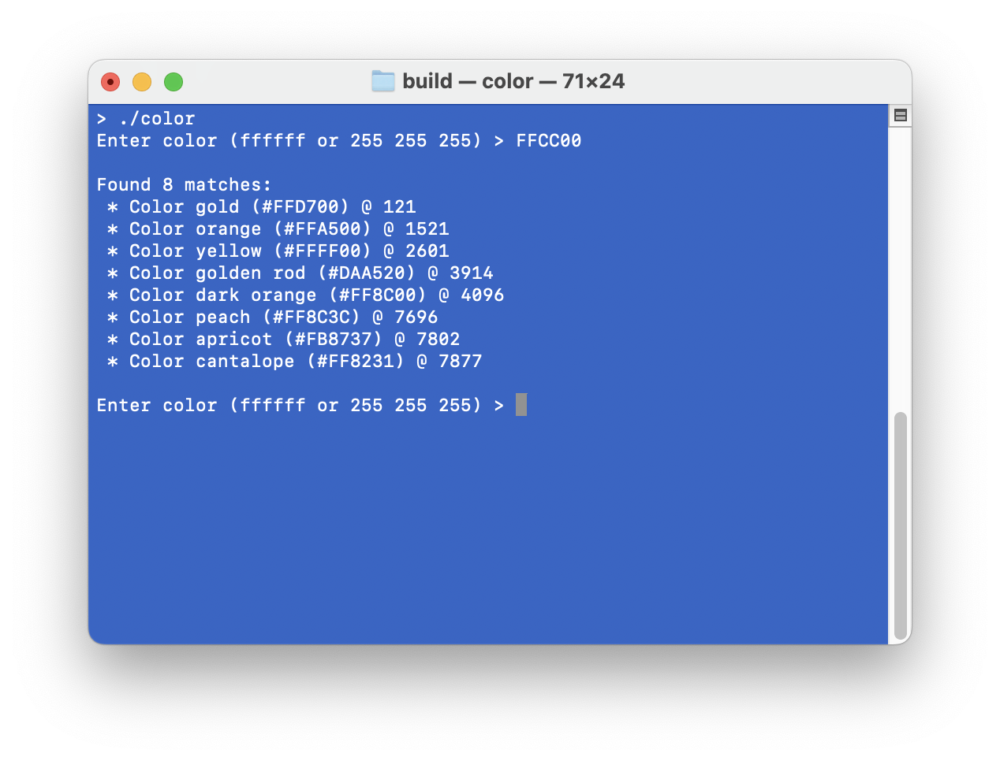

## Color Sample App

The Color app illustrates the use of [Couchbase Lite Vector Search Library and API](https://docs.couchbase.com/couchbase-lite/3.2/c/vector-search.html) to create a vector index and to perform vector similarity search for finding similar colors based on 3-dimensional color vectors.

### Overview ###

Each color can be encoded as a 3-dimension vectors or a set of three numbers, with each value ranging from 0 to 255. These three numbers correspond to the intensity of the Red (R), Green (G), and Blue (B) components that combine to create a color. For instance, the pink color is represented by `[255, 192, 203]` or `0xFFC0CB` in hexadecimal format. With all possible combinations of the three numbers, the total number of colors generated is 16,581,375.

To find similar colors in the color space, users enter the RGB vector of a color to search and the app performs a similarity search based on the euclidean distances calcuated between the search color and the database of available colors. The top 8 similar colors are returned. The app utilizes Couchbase Lite's Vector Index that allows the vector search to perform efficently.

### Inside the App ###

#### Dataset ####

The app includes 153 documents in the `colors` collection of the `default` scope in the embedded Couchbase Lite database. Each document contains information about a color as shown in this example:

```
{
  "id": "#FFEFD5",
  "color": "papaya whip",
  "colorvect_l2": [255, 239, 213],
  "brightness": 240.82,
  "wheel_pos": "other",
  "verbs": ["soften", "mellow", "lighten"],
  "description": "Papaya whip is a soft ... ",
  "embedding_model": "text-embedding-ada-002-v2",
  "embedding_vector_dot": [ -0.014644118957221508, ... ]
}
```
The app uses 3 properties from the documents:

* 'id' : Color in hexadecimal format
* 'color' : Color name
* 'colorvect_l2' : Color in 3-dimension vector (3 RGB numbers). The vector embeddings are included inline in the document.

#### Building Vector Index ####

When running the app for the first time, the app will load a [prebuilt database](https://docs.couchbase.com/couchbase-lite/current/c/prebuilt-database.html) containing the dataset as described above. The app will then create a vector index from the `colorvect_l2` property of the documents in the `colors` collection. As the dataset is pretty small, the app uses a small number of centroids (2) and opts to use no vector encoding to maximize accuracy and use less computation. Note that the euclidean distance metric is selected by default. To learn more about vector index and tuning, check this [guide](https://github.com/couchbaselabs/mobile-vector-search/blob/main/docs/Tuning.md). 

This is relevant code snippet
```
  CBLError error{};

  // Create a vector index config:
  CBLVectorIndexConfiguration config{};
  config.expressionLanguage = kCBLN1QLLanguage;
  config.expression = FLStr("colorvect_l2");
  config.dimensions = 3;
  config.centroids = 2;
  config.encoding = CBLVectorEncoding_CreateNone();

  // Create a vector index with the config:
  bool success = CBLCollection_CreateVectorIndex(_collection, FLStr(kIndexName), config, &error);
  CBLVectorEncoding_Free(config.encoding);
  if (!success) {
    throw CBLException(error);
  }
  
```

#### Running Similarity Search Query ####

The app lets users enter colors in three-number or hexadecimal format to search for similar colors. When searching, the app uses an SQL++ query with the `vector_match()` function against the created vector index. The top 8 KNN results are returned and displayed.

This is relevant code snippet
```
  CBLError error{};

  // Create a vector search query:
  if (!_query) {
    stringstream sql;
    sql << "SELECT id, color, VECTOR_DISTANCE(" << kIndexName << ") "
        << "FROM " << kCollectionName << " "
        << "WHERE VECTOR_MATCH(" << kIndexName << ", $vector, 8)";

    _query = CBLDatabase_CreateQuery(_database,kCBLN1QLLanguage,FLS(sql.str()),nullptr, &error);
    if (!_query) {
      throw CBLException(error);
    }
  }

  // Set the input color vector to $vector parameter of the query:
  auto colorArray = FLMutableArray_New();
  for (auto val : colorVector) {
    FLMutableArray_AppendFloat(colorArray, val);
  }

  auto params = FLMutableDict_New();
  FLMutableDict_SetArray(params, FLSTR("vector"), colorArray);
  CBLQuery_SetParameters(_query, params);

  FLMutableArray_Release(colorArray);
  FLMutableDict_Release(params);

  // Execute the query:
  auto results = CBLQuery_Execute(_query, &error);
```

#### The AI Model ####

In a real world application, the vector embeddings will be generated by the application by accessing a suitable AI embedding model. In the sample app, the documents with the vector embeddings are included in the prebuilt database. The vector corresponding to the search query would also be generated by the model. In this simple exmaple, user is expected to enter the RGB vector corresponding to the color to search.

### Prerequisites ###

To run this project, you will need:
* cmake 3.20+
* clang or gcc
* [Couchbase Lite C 3.2.0-beta](https://docs.couchbase.com/couchbase-lite/3.2/c/gs-install.html) (Preconfigured as SPM dependecy)
* [Couchbase Lite Vector Search 1.0.0-beta](https://docs.couchbase.com/couchbase-lite/3.2/c/gs-install.html#install-vector-search-extension)

### Running the App ###

* Clone the repo
* Copy and extract the downloaded Couchbase Lite C library into `lib/libcblite/` directory. The directory should include `lib` and `include` directory.
* Copy and extract the downloaded Couchbase LiteVector Search library into `extension` directory. The directory should include the vector search dynamic library file.
* mkdir build && cd build
* cmake ..
* make
* ./color

### Screenshot ###


